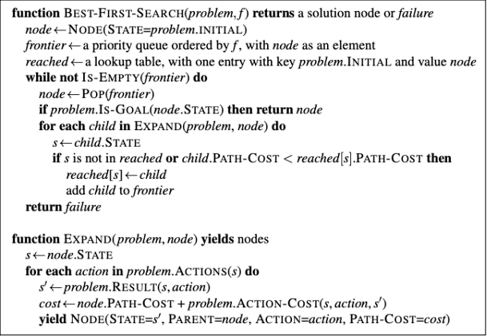

# Algoritmo A*
## Situação Problema
Criação do caminho mais curto de viagem: Um indivíduo está viajando com pouca gasolina e precisa descobrir qual o caminho mais curto para chegar da cidade Y a cidade X antes que seu combustível acabe.
## Modelagem Escolhida: Grafos
A modelagem desse problema é criada por meio de grafos. Cada vértice representa uma cidade, suas arestas, o caminho até elas e os pesos atribuídos às arestas suas respectivas distâncias. Para este problema estamos considerando apenas grafos simples e não direcionados.  
Considerando a abordagem de programação orientada a objetos, a modelagem aconteceu por meio da divisão entre classes e funções de acordo com a natureza do gráfico proposto.   
No total, há 5 classes: Aresta.js, Capitais.js, Grafo.js, Vertice.js e Main.js. Fazem parte da modelagem do problema as classes Aresta.js, Grafo.js e Vertice.js.
>A classe Aresta possui parâmetros de vértice 1, vértice 2, peso e rótulo. 

~~~  
class Aresta {
    constructor(vertice1, vertice2, rotulo, peso) {
        this.vertice1 = vertice1;
        this.vertice2 = vertice2;
        this.rotulo = rotulo || null;
        this.peso = peso || 0;
    }
    
    getVertice1() {return this.vertice1;

    getVertice2() { return this.vertice2;}

    getRotulo() { return this.rotulo;}

    setVertice1(vertice1) {this.vertice1 = vertice1;}
    
    setVertice2(vertice2) {this.vertice2 = vertice2;}

    setRotulo(rotulo) {this.rotulo = rotulo;}

    getPeso() {return this.peso;}

    setPeso(peso) {this.peso = peso;}

    getAresta() {
        if (this.rotulo === null) {
            console.log(`(${this.getVertice1().getRotulo()} - ${this.getVertice2().getRotulo()}) Dist: ${this.getPeso()}km`);
        } else {
            console.log(`(${this.getVertice1().getRotulo()} - ${this.getVertice2().getRotulo()}) Dist: ${this.getPeso()}km`);
        }
  }
 }
}
~~~

>A classe Vértice, por sua vez, possui os parâmetros rótulos, índice, vértices vizinhos e distâncias.

~~~
class Vertice {
    constructor(indice, rotulo) {
        this.rotulo = rotulo || `v${indice}`;
        this.indice = indice;
        this.flag = false;
        this.verticesVizinhos = [];
        this.distancias = [];
    }

    getRotulo() {return this.rotulo;}

    getCidade() {
        return this.rotulo.substring(0,
        this.rotulo.length - 3);}

    setRotulo(rotulo) {this.rotulo = rotulo;}

    getIndice() {return this.indice;}

    setIndice(indice) {this.indice = indice;}

    getFlag() {return this.flag;}

    setFlag(flag) {this.flag = flag;}

    getVerticesVizinhos() {
        return this.verticesVizinhos;}

    addVerticeVizinho(vertice) {
        this.verticesVizinhos.push(vertice);}

    removeVerticeVizinho(vertice) {
        const index = this.verticesVizinhos.indexOf(vertice);
        if (index !== -1) {
            this.verticesVizinhos.splice(index, 1);
        }
    }

    getVerticeVizinho(i) {
        return this.verticesVizinhos[i];
    }

    addDistancia(distancia) {
        this.distancias.push(distancia);
    }

    setDistancia(posicao, distancia) {
        if (posicao >= 1) {
            this.distancias[posicao - 1] = distancia;
            return true;
        }
        return false;
    }

    getDistancias() {return this.distancias;}

    setDistancias(distancias) {
        this.distancias = distancias;
    }

    getVerticeVizinhoByRotulo(rotulo) {
        const verticeVizinho = this.verticesVizinhos.find((vertice) => vertice.getRotulo() === rotulo);
        if (!verticeVizinho) {
            throw new Error("Rotulo invalido");
        }
        return verticeVizinho;
    }
}
~~~

>A classe Grafo possui como parâmetros o número de vértices, arestas e quais são as suas respectivas listas. Nesta mesma classe, temos as funções getVertice(), adicionarAresta(), adicionarArestaComRotulo() e imprimirGrafo().

~~~
class Grafo {
  constructor(numVertices) {
    this.numVertices = numVertices;
    this.numArestas = 0;
    this.vertices = [];
    this.arestas = [];
  }

  getNumVertices() {return this.numVertices;}

  getNumArestas() {return this.numArestas;}

  adicionarVertice(indice, rotulo) {
    this.vertices.push(new Vertice(indice, rotulo));

    for (let i = 0; i < this.getNumVertices(); i++) {
      this.getVertice(indice).addDistancia(0);
    }
  }

  getVertice(i) {return this.vertices[i - 1];}

  criarMatrizDePesos() {
    const matrixDePesos = Array.from({ length: this.getNumVertices() }, () =>
      Array.from({ length: this.getNumVertices() }, () => 0)
    );

    for (let linhas = 0; linhas < this.getNumVertices(); linhas++) {
      for (let colunas = 0; colunas < this.getNumVertices(); colunas++) {
        matrixDePesos[linhas][colunas] = this.getVertice(linhas + 1).getDistancias()[colunas];
      }
    }

    return matrixDePesos;
  }

  adicionarAresta(origem, destino, peso) {
    if (origem === destino) {
      this.getVertice(origem).addVerticeVizinho(this.getVertice(destino));
    } else {
      this.getVertice(origem).addVerticeVizinho(this.getVertice(destino));
      this.getVertice(origem).setDistancia(destino, peso);
      this.getVertice(destino).addVerticeVizinho(this.getVertice(origem));
      this.getVertice(destino).setDistancia(origem, peso);
    }
    this.arestas.push(new Aresta(this.getVertice(origem), this.getVertice(destino), peso));
    this.numArestas++;
  }

  adicionarArestaComRotulo(origem, destino, rotulo, peso) {
    if (origem === destino) {
      this.getVertice(origem).addVerticeVizinho(this.getVertice(destino));
    } else {
      this.getVertice(origem).addVerticeVizinho(this.getVertice(destino));
      this.getVertice(origem).setDistancia(destino, peso);
      this.getVertice(destino).addVerticeVizinho(this.getVertice(origem));
      this.getVertice(destino).setDistancia(origem, peso);
    }

    this.arestas.push(new Aresta(this.getVertice(origem), this.getVertice(destino), rotulo, peso));
    this.numArestas++;
  }
  imprimirGrafo() {
    console.log("\nNumero de vertices: " + this.getNumVertices());
    console.log("Numero de arestas: " + this.getNumArestas() + "\n");

    console.log("Estrutura de dados: \n\nLista de Adjacencia");

    for (let x = 0; x < this.getNumVertices(); x++) {
      process.stdout.write(this.vertices[x].getRotulo() + " -> ");
      for (const vertice of this.vertices[x].verticesVizinhos) {
        process.stdout.write(vertice.getRotulo() + "  ");
      }

    }
    if (this.numArestas > 0) {
      console.log("\nLista de Distancias: ");
      for (const aresta of this.arestas) {
        aresta.getAresta();
      }
    }

    console.log(); 
}
}
~~~

## Implementação do Algoritmo A*
### De acordo com o pseudo código proposto:

### Definimos a seguinte heurística para o Algoritmo A*

~~~
heuristica(verticeAtual, verticeDestino) {    
  return verticeAtual.getDistancias()[verticeDestino.getIndice() - 1];
  }
~~~
>Levamos em conta o custo dos caminhos para obter o caminho com menor custo.

### Segue o resto do algoritmo

~~~
// Função que implementa o algoritmo A* em um grafo
aStar(grafo, origem, destino) {
    // Inicializa arrays para armazenar distâncias, pais, fScore e gScore
    const dist = new Array(this.getNumVertices()).fill(Number.MAX_SAFE_INTEGER);
    const pai = new Array(this.getNumVertices()).fill(null);
    const fScore = new Array(this.getNumVertices()).fill(Number.MAX_SAFE_INTEGER);
    const gScore = new Array(this.getNumVertices()).fill(Number.MAX_SAFE_INTEGER);

    // Conjunto para rastrear vértices a serem explorados
    const openSet = new Set();

    // Inicializa o gScore para o vértice de origem como 0
    gScore[origem - 1] = 0;

    // Inicializa o fScore usando uma heurística para o vértice de origem
    fScore[origem - 1] = this.heuristica(this.getVertice(origem), this.getVertice(destino));

    // Adiciona o vértice de origem ao conjunto de vértices a serem explorados
    openSet.add(origem);

    // Loop principal enquanto há vértices para explorar
    while (openSet.size > 0) {
        // Encontra o vértice atual com menor fScore
        const verticeAtual = Array.from(openSet).reduce((a, b) => (fScore[a - 1] < fScore[b - 1] ? a : b));

        // Verifica se o vértice atual é o destino e reconstrói o caminho
        if (verticeAtual === destino) {
            const caminho = [];
            let vertice = destino;

            // Reconstrói o caminho percorrendo os pais
            while (pai[vertice - 1] !== null) {
                caminho.unshift(vertice);
                vertice = pai[vertice - 1];
            }

            // Adiciona o vértice de origem ao caminho
            caminho.unshift(origem);
            return caminho;
        }

        // Remove o vértice atual do conjunto de vértices a serem explorados
        openSet.delete(verticeAtual);

        // Loop pelos vértices vizinhos do vértice atual
        for (const verticeVizinho of this.getVertice(verticeAtual).verticesVizinhos) {
            // Calcula a tentativa de gScore para o vértice vizinho
            const tentativaGScore = gScore[verticeAtual - 1] + grafo[verticeAtual - 1][verticeVizinho.getIndice() - 1];

            // Verifica se a tentativa de gScore é menor que o valor atual de gScore
            if (tentativaGScore < gScore[verticeVizinho.getIndice() - 1]) {
                // Atualiza o pai, gScore e fScore para o vértice vizinho
                pai[verticeVizinho.getIndice() - 1] = verticeAtual;
                gScore[verticeVizinho.getIndice() - 1] = tentativaGScore;
                fScore[verticeVizinho.getIndice() - 1] =
                    gScore[verticeVizinho.getIndice() - 1] + this.heuristica(verticeVizinho, this.getVertice(destino));

                // Adiciona o vértice vizinho ao conjunto de vértices a serem explorados, se ainda não estiver presente
                if (!openSet.has(verticeVizinho.getIndice())) {
                    openSet.add(verticeVizinho.getIndice());
                }
            }
        }
    }

    // Caminho não encontrado, retorna nulo
    return null;
}
~~~

## Casos de Teste, Complexidade do Algoritmo e Discussão

### Casos de Teste

#### Caso de teste 1: 
Considere um grafo simples com 5 vértices e arestas conectando todos os vértices de forma sequencial (1-2, 2-3, 3-4, 4-5). O peso de cada aresta é igual à diferença entre os vértices que ela conecta. Nesse caso, o caminho mais curto de 1 a 5 seria a sequência direta de 1 a 5.

#### Caso de teste 2: 
Considere um grafo com 5 vértices onde o vértice 1 está conectado a todos os outros vértices e os outros vértices estão conectados em uma sequência (2-3, 3-4, 4-5). O peso de cada aresta é igual à diferença entre os vértices que ela conecta, exceto para as arestas conectando o vértice 1, que têm peso 10. Nesse caso, o caminho mais curto de 1 a 5 seria a aresta direta de 1 a 5, apesar do seu peso maior.

### Complexidade do Algoritmo
Vamos assumir que **b** é o fator de ramificação médio do grafo (número médio de vértices sucessores) e **d** é a profundidade da solução no espaço de busca.

No pior caso, onde todos os caminhos precisam ser explorados, a heurística não fornece uma vantagem significativa, e a complexidade de tempo pode se aproximar da busca de custo uniforme. Nesse caso, a complexidade de tempo seria <strong><em>O(b^d)</em></strong>.

No melhor caso, onde a heurística é altamente informativa e guia o algoritmo diretamente para a solução, a complexidade de tempo pode ser significativamente menor.

A heurística apresentada, que retorna o peso da aresta entre os vértices, pode ser boa para grafos onde os pesos das arestas são representativos da "distância" entre os vértices. Se for assim, a heurística pode proporcionar uma estimativa eficiente do custo restante para o destino.

Em resumo, a eficácia do <strong>A*</strong> com essa heurística dependerá fortemente das características específicas do grafo e da qualidade da heurística. 

Em casos ideais, onde a heurística é boa, a complexidade de tempo pode ser significativamente menor do que 
O(b^d). No entanto, em casos menos ideais, onde a heurística não fornece uma vantagem substancial, a complexidade de tempo pode se aproximar de <strong><em>O(b^d)</em></strong>.

### Discussão

O algoritmo A* é um algoritmo de busca informada que usa uma heurística para estimar o custo do caminho da origem ao destino. A eficácia do algoritmo depende fortemente da qualidade da heurística. Se a heurística for capaz de fornecer uma boa estimativa do custo restante para o destino, o algoritmo A* pode encontrar o caminho mais curto de maneira eficiente.

No entanto, se a heurística não fornece uma boa estimativa, o algoritmo A* pode acabar explorando muitos caminhos desnecessários, resultando em uma eficiência semelhante à busca de custo uniforme. Além disso, a heurística deve ser admissível, ou seja, nunca deve superestimar o custo para alcançar o objetivo. Se a heurística não for admissível, o algoritmo A* pode não encontrar o caminho mais curto.

Além disso, o algoritmo A* tem uma complexidade de espaço de O(b^d), o que significa que ele pode consumir uma quantidade significativa de memória para problemas grandes ou para grafos com um grande fator de ramificação. Isso pode ser um problema para aplicações em tempo real ou para dispositivos com recursos limitados.

Em resumo, o algoritmo A* é uma ferramenta poderosa para encontrar o caminho mais curto em um grafo, mas sua eficácia e eficiência dependem fortemente da qualidade da heurística e das características específicas do grafo. Portanto, é importante escolher ou projetar uma heurística adequada ao problema específico que se está tentando resolver.