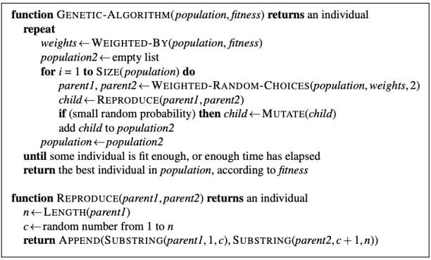

# Algoritmo Genético
## Situação Problema
O problema clássico de otimização combinatória da mochila (Knapsack Problem). O objetivo é determinar o número máximo de itens que podem ser colocados em uma mochila, dado um conjunto de itens com pesos e valores específicos e a capacidade máxima da mochila.
## Modelagem Escolhida 
Usando o algoritmo genético podemos definir uma técnica de busca heurística inspirada na evolução natural. Eles refletem os processos que ocorrem na evolução natural de espécies, como herança, mutação, seleção e crossover (ou recombinação).

>A classe Item e Mochila definem os principais itens a serem explorados.

~~~
class Item {
  constructor(nome, peso, valor) {
    this.nome = nome;
    this.peso = peso;
    this.valor = valor;
  }
}

class Mochila {
  constructor(capacidade) {
    this.capacidade = capacidade;
    this.itens = [];
  }

  adicionarItem(item) {
    this.itens.push(item);
  }
}
~~~

## Implementação do Algoritmo Genético
### De acordo com o pseudo código proposto:

### Heurística do Algoritmo genético:
A heurística do algoritmo se baseam nos princípios da evolução natural, que incluem seleção, crossover (ou recombinação) e mutação. Detalhando-os

- **Seleção:** A função de seleção escolhe os indivíduos mais aptos da população para serem pais da próxima geração. No nosso caso, ordenamos a população com base no fitness em ordem decrescente e seleciona os melhores indivíduos (50% da população).
- **Crossover:** A função de crossover combina dois pais para gerar descendentes, na esperança de que os descendentes sejam melhores que os pais. Nós usamos um ponto de crossover aleatório para combinar dois pais e gerar dois filhos.
- **Mutação:**  A função de mutação altera aleatoriamente alguns genes em um indivíduo para manter a diversidade na população e evitar o bloqueio em soluções subótimas. Nós invertemos um bit com uma certa probabilidade (taxa de mutação).

### Segue o Algoritmo Genético:
~~~
class AlgoritmoGenetico {
    constructor(tamanhoPopulacao, taxaMutacao, taxaCrossover, mochila) {
        this.tamanhoPopulacao = tamanhoPopulacao;
        this.taxaMutacao = taxaMutacao;
        this.taxaCrossover = taxaCrossover;
        this.mochila = mochila;
        this.populacao = [];
        this.Cromossomos = [];
        this.inicializarPopulacao();
    }

    inicializarPopulacao() {
        for (let i = 0; i < this.tamanhoPopulacao; i++) {
            const cromossomo = this.criarCromossomo();
            this.populacao.push(cromossomo);
        }
    }

    criarCromossomo() {
        const cromossomo = [];
        for (let i = 0; i < this.mochila.itens.length; i++) {
            // Adiciona aleatoriamente 0 ou 1 ao cromossomo
            cromossomo.push(Math.random() > 0.5 ? 1 : 0);
        }
        this.Cromossomos.push(cromossomo)
        return cromossomo;
    }

    calcularFitness(cromossomo) {
        let pesoTotal = 0;
        let valorTotal = 0;

        for (let i = 0; i < cromossomo.length; i++) {
            if (cromossomo[i] === 1) {
                pesoTotal += this.mochila.itens[i].peso;
                valorTotal += this.mochila.itens[i].valor;
            }
        }

        // Penalizar soluções que ultrapassam a capacidade da mochila
        const capacidadeExcedida = pesoTotal - this.mochila.capacidade;
        const penalidade = capacidadeExcedida > 0 ? 1000 : 0; // Ajuste o valor da penalidade conforme necessário

        const fitness = valorTotal - penalidade;

        return fitness;
    }

    selecao() {
        // Ordena a população com base no fitness em ordem decrescente
        this.populacao.sort((a, b) => this.calcularFitness(b) - this.calcularFitness(a));

        // Retorna os melhores indivíduos (50% da população)
        const metadePopulacao = Math.ceil(this.tamanhoPopulacao / 2);
        return this.populacao.slice(0, metadePopulacao);
    }

    crossover(pai1, pai2) {
        const pontoCrossover = Math.floor(Math.random() * pai1.length);

        const filho1 = pai1.slice(0, pontoCrossover).concat(pai2.slice(pontoCrossover));
        const filho2 = pai2.slice(0, pontoCrossover).concat(pai1.slice(pontoCrossover));

        return [filho1, filho2];
    }

    mutacao(cromossomo) {
        for (let i = 0; i < cromossomo.length; i++) {
            if (Math.random() < this.taxaMutacao) {
                // Inverte o bit
                cromossomo[i] = 1 - cromossomo[i];
            }
        }
    }

    evoluir() {
        const pais = this.selecao();
        const novaPopulacao = [];

        // Adiciona os pais à nova população
        novaPopulacao.push(...pais);

        // Realiza crossover e mutação para gerar novos indivíduos até atingir o tamanho da população original
        while (novaPopulacao.length < this.tamanhoPopulacao) {
            const pai1 = pais[Math.floor(Math.random() * pais.length)];
            const pai2 = pais[Math.floor(Math.random() * pais.length)];

            const filhos = this.crossover(pai1, pai2);

            for (const filho of filhos) {
                this.mutacao(filho);
                novaPopulacao.push(filho);
            }
        }

        this.populacao = novaPopulacao;
    }

    encontrarMelhorSolucao(generacoes) {
        for (let geracao = 0; geracao < generacoes; geracao++) {
            this.evoluir();
        }

        // Ordena a população pelo valor em ordem decrescente
        this.populacao.sort((a, b) => this.calcularFitness(b) - this.calcularFitness(a));

        // Retorna o melhor cromossomo da população
        return this.populacao[0];
    }
}
~~~

## Casos de Teste, Complexidade do Algoritmo e Discussão
### Casos de Teste

> Caso de Teste 1 **(Quantidade de itens: 5; População:100)**
- Verificado o caso de teste foi identificado que o algoritmo levou em média <strong>0.015 *segundos*</strong> para solucionar o problema de maneira correta, utilizando como taxas de **<em>mutação e crossover</em>**, respectivamente: **0.2; 0.9;**.

> Caso de Teste 2 **(Quantidade de itens: 50; População:10000)**
- Verificado o caso de teste foi identificado que o algoritmo levou em média <strong>2 *segundos*</strong> para solucionar o problema de maneira correta, utilizando como taxas de **<em>mutação e crossover</em>**, respectivamente: **0.2; 0.9;**.

### Complexidade do Algoritmo
A complexidade de tempo de um algoritmo genético é geralmente O(m*n), onde m é o número de indivíduos na população (ou seja, o tamanho da população) e n é o número de gerações. 

No entanto, a complexidade pode variar dependendo dos detalhes específicos do seu algoritmo, como a forma como você implementa a seleção, crossover e mutação.