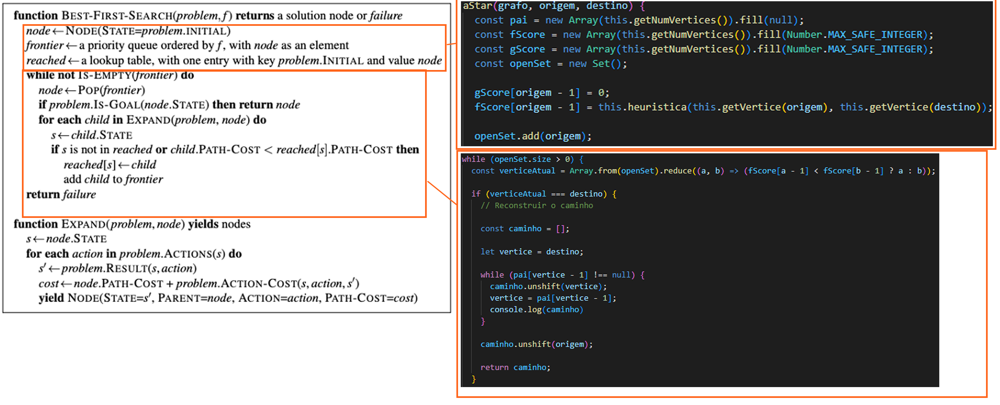
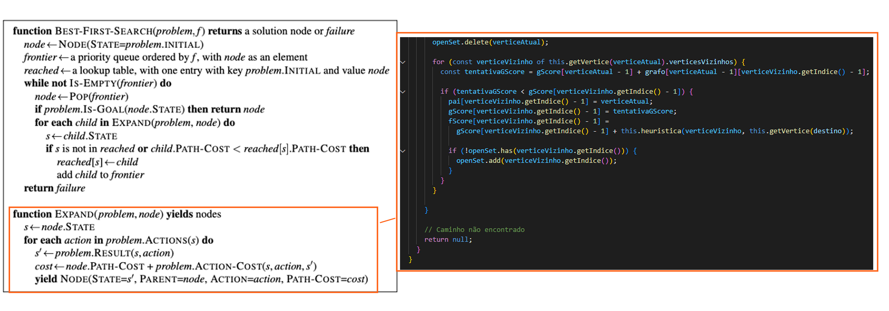
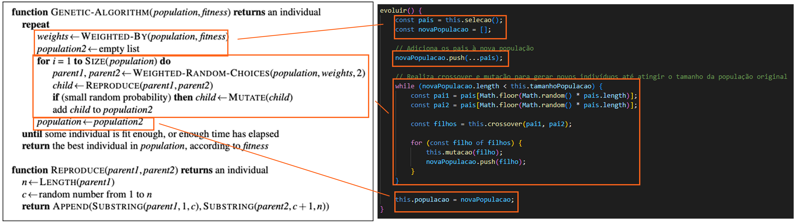
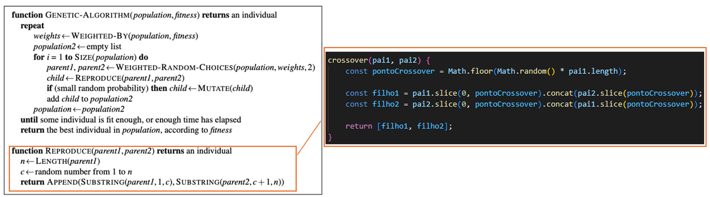
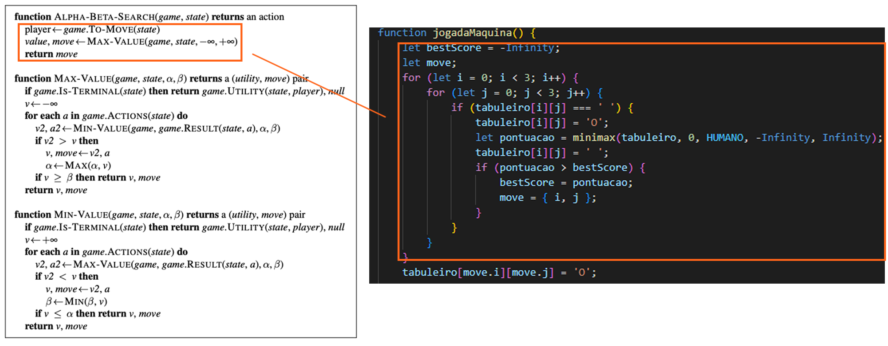
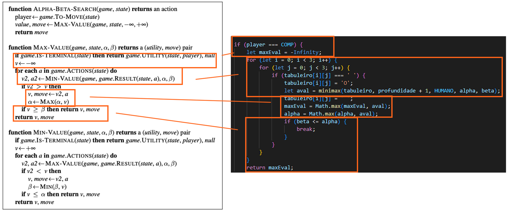
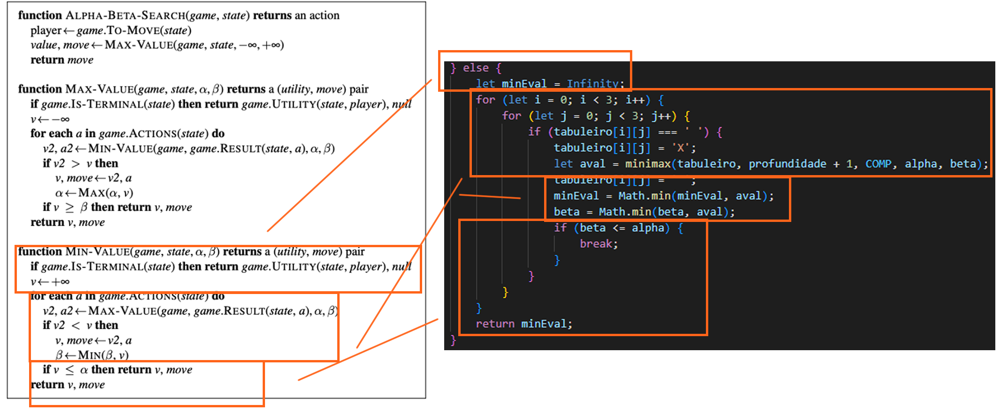
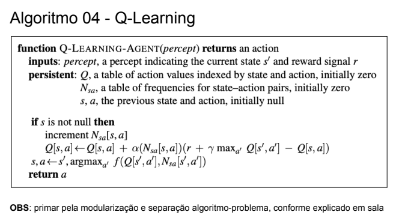
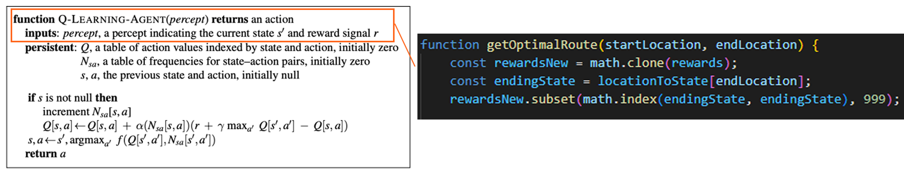
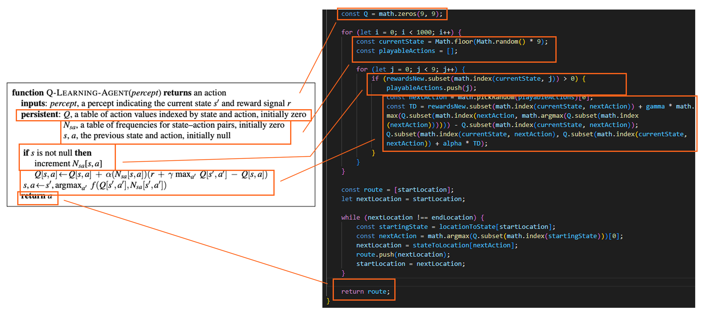

# Alunos Responsáveis:

- Gabriel Teixeira Silveira
- Leticia Cena dos Santos 
- Guilherme Pinto Almeida

# Sumário para Algoritmos:

- [Algoritmo A*](#algoritmo-astar)
- [Algoritmo Genético](#algoritmo-genético)
- [Algoritmo Minimax](#algoritmo-minimax)
- [Algoritmo Q-Learning](#algoritmo-q-learning)

# Algoritmo AStar

## Situação Problema
Criação do caminho mais curto de viagem: Um indivíduo está viajando com pouca gasolina e precisa descobrir qual o caminho mais curto para chegar da cidade Y a cidade X antes que seu combustível acabe.
## Modelagem Escolhida: Grafos
A modelagem desse problema é criada por meio de grafos. Cada vértice representa uma cidade, suas arestas, o caminho até elas e os pesos atribuídos às arestas suas respectivas distâncias. Para este problema estamos considerando apenas grafos simples e não direcionados.  
Considerando a abordagem de programação orientada a objetos, a modelagem aconteceu por meio da divisão entre classes e funções de acordo com a natureza do gráfico proposto.   
No total, há 5 classes: Aresta.js, Capitais.js, Grafo.js, Vertice.js e Main.js. Fazem parte da modelagem do problema as classes Aresta.js, Grafo.js e Vertice.js.
>A classe Aresta possui parâmetros de vértice 1, vértice 2, peso e rótulo. 

~~~  
class Aresta {
    constructor(vertice1, vertice2, rotulo, peso) {
        this.vertice1 = vertice1;
        this.vertice2 = vertice2;
        this.rotulo = rotulo || null;
        this.peso = peso || 0;
    }
    
    getVertice1() {return this.vertice1;

    getVertice2() { return this.vertice2;}

    getRotulo() { return this.rotulo;}

    setVertice1(vertice1) {this.vertice1 = vertice1;}
    
    setVertice2(vertice2) {this.vertice2 = vertice2;}

    setRotulo(rotulo) {this.rotulo = rotulo;}

    getPeso() {return this.peso;}

    setPeso(peso) {this.peso = peso;}

    getAresta() {
        if (this.rotulo === null) {
            console.log(`(${this.getVertice1().getRotulo()} - ${this.getVertice2().getRotulo()}) Dist: ${this.getPeso()}km`);
        } else {
            console.log(`(${this.getVertice1().getRotulo()} - ${this.getVertice2().getRotulo()}) Dist: ${this.getPeso()}km`);
        }
  }
 }
}
~~~

>A classe Vértice, por sua vez, possui os parâmetros rótulos, índice, vértices vizinhos e distâncias.

~~~
class Vertice {
    constructor(indice, rotulo) {
        this.rotulo = rotulo || `v${indice}`;
        this.indice = indice;
        this.flag = false;
        this.verticesVizinhos = [];
        this.distancias = [];
    }

    getRotulo() {return this.rotulo;}

    getCidade() {
        return this.rotulo.substring(0,
        this.rotulo.length - 3);}

    setRotulo(rotulo) {this.rotulo = rotulo;}

    getIndice() {return this.indice;}

    setIndice(indice) {this.indice = indice;}

    getFlag() {return this.flag;}

    setFlag(flag) {this.flag = flag;}

    getVerticesVizinhos() {
        return this.verticesVizinhos;}

    addVerticeVizinho(vertice) {
        this.verticesVizinhos.push(vertice);}

    removeVerticeVizinho(vertice) {
        const index = this.verticesVizinhos.indexOf(vertice);
        if (index !== -1) {
            this.verticesVizinhos.splice(index, 1);
        }
    }

    getVerticeVizinho(i) {
        return this.verticesVizinhos[i];
    }

    addDistancia(distancia) {
        this.distancias.push(distancia);
    }

    setDistancia(posicao, distancia) {
        if (posicao >= 1) {
            this.distancias[posicao - 1] = distancia;
            return true;
        }
        return false;
    }

    getDistancias() {return this.distancias;}

    setDistancias(distancias) {
        this.distancias = distancias;
    }

    getVerticeVizinhoByRotulo(rotulo) {
        const verticeVizinho = this.verticesVizinhos.find((vertice) => vertice.getRotulo() === rotulo);
        if (!verticeVizinho) {
            throw new Error("Rotulo invalido");
        }
        return verticeVizinho;
    }
}
~~~

>A classe Grafo possui como parâmetros o número de vértices, arestas e quais são as suas respectivas listas. Nesta mesma classe, temos as funções getVertice(), adicionarAresta(), adicionarArestaComRotulo() e imprimirGrafo().

~~~
class Grafo {
  constructor(numVertices) {
    this.numVertices = numVertices;
    this.numArestas = 0;
    this.vertices = [];
    this.arestas = [];
  }

  getNumVertices() {return this.numVertices;}

  getNumArestas() {return this.numArestas;}

  adicionarVertice(indice, rotulo) {
    this.vertices.push(new Vertice(indice, rotulo));

    for (let i = 0; i < this.getNumVertices(); i++) {
      this.getVertice(indice).addDistancia(0);
    }
  }

  getVertice(i) {return this.vertices[i - 1];}

  criarMatrizDePesos() {
    const matrixDePesos = Array.from({ length: this.getNumVertices() }, () =>
      Array.from({ length: this.getNumVertices() }, () => 0)
    );

    for (let linhas = 0; linhas < this.getNumVertices(); linhas++) {
      for (let colunas = 0; colunas < this.getNumVertices(); colunas++) {
        matrixDePesos[linhas][colunas] = this.getVertice(linhas + 1).getDistancias()[colunas];
      }
    }

    return matrixDePesos;
  }

  adicionarAresta(origem, destino, peso) {
    if (origem === destino) {
      this.getVertice(origem).addVerticeVizinho(this.getVertice(destino));
    } else {
      this.getVertice(origem).addVerticeVizinho(this.getVertice(destino));
      this.getVertice(origem).setDistancia(destino, peso);
      this.getVertice(destino).addVerticeVizinho(this.getVertice(origem));
      this.getVertice(destino).setDistancia(origem, peso);
    }
    this.arestas.push(new Aresta(this.getVertice(origem), this.getVertice(destino), peso));
    this.numArestas++;
  }

  adicionarArestaComRotulo(origem, destino, rotulo, peso) {
    if (origem === destino) {
      this.getVertice(origem).addVerticeVizinho(this.getVertice(destino));
    } else {
      this.getVertice(origem).addVerticeVizinho(this.getVertice(destino));
      this.getVertice(origem).setDistancia(destino, peso);
      this.getVertice(destino).addVerticeVizinho(this.getVertice(origem));
      this.getVertice(destino).setDistancia(origem, peso);
    }

    this.arestas.push(new Aresta(this.getVertice(origem), this.getVertice(destino), rotulo, peso));
    this.numArestas++;
  }
  imprimirGrafo() {
    console.log("\nNumero de vertices: " + this.getNumVertices());
    console.log("Numero de arestas: " + this.getNumArestas() + "\n");

    console.log("Estrutura de dados: \n\nLista de Adjacencia");

    for (let x = 0; x < this.getNumVertices(); x++) {
      process.stdout.write(this.vertices[x].getRotulo() + " -> ");
      for (const vertice of this.vertices[x].verticesVizinhos) {
        process.stdout.write(vertice.getRotulo() + "  ");
      }

    }
    if (this.numArestas > 0) {
      console.log("\nLista de Distancias: ");
      for (const aresta of this.arestas) {
        aresta.getAresta();
      }
    }

    console.log(); 
}
}
~~~

## Implementação do Algoritmo A*
### De acordo com o pseudo código proposto:

### Definimos a seguinte heurística para o Algoritmo A*

~~~
heuristica(verticeAtual, verticeDestino) {    
  return verticeAtual.getDistancias()[verticeDestino.getIndice() - 1];
  }
~~~
>Levamos em conta o custo dos caminhos para obter o caminho com menor custo.

### Segue o resto do algoritmo

~~~
// Função que implementa o algoritmo A* em um grafo
aStar(grafo, origem, destino) {
    // Inicializa arrays para armazenar distâncias, pais, fScore e gScore
    const dist = new Array(this.getNumVertices()).fill(Number.MAX_SAFE_INTEGER);
    const pai = new Array(this.getNumVertices()).fill(null);
    const fScore = new Array(this.getNumVertices()).fill(Number.MAX_SAFE_INTEGER);
    const gScore = new Array(this.getNumVertices()).fill(Number.MAX_SAFE_INTEGER);

    // Conjunto para rastrear vértices a serem explorados
    const openSet = new Set();

    // Inicializa o gScore para o vértice de origem como 0
    gScore[origem - 1] = 0;

    // Inicializa o fScore usando uma heurística para o vértice de origem
    fScore[origem - 1] = this.heuristica(this.getVertice(origem), this.getVertice(destino));

    // Adiciona o vértice de origem ao conjunto de vértices a serem explorados
    openSet.add(origem);

    // Loop principal enquanto há vértices para explorar
    while (openSet.size > 0) {
        // Encontra o vértice atual com menor fScore
        const verticeAtual = Array.from(openSet).reduce((a, b) => (fScore[a - 1] < fScore[b - 1] ? a : b));

        // Verifica se o vértice atual é o destino e reconstrói o caminho
        if (verticeAtual === destino) {
            const caminho = [];
            let vertice = destino;

            // Reconstrói o caminho percorrendo os pais
            while (pai[vertice - 1] !== null) {
                caminho.unshift(vertice);
                vertice = pai[vertice - 1];
            }

            // Adiciona o vértice de origem ao caminho
            caminho.unshift(origem);
            return caminho;
        }

        // Remove o vértice atual do conjunto de vértices a serem explorados
        openSet.delete(verticeAtual);

        // Loop pelos vértices vizinhos do vértice atual
        for (const verticeVizinho of this.getVertice(verticeAtual).verticesVizinhos) {
            // Calcula a tentativa de gScore para o vértice vizinho
            const tentativaGScore = gScore[verticeAtual - 1] + grafo[verticeAtual - 1][verticeVizinho.getIndice() - 1];

            // Verifica se a tentativa de gScore é menor que o valor atual de gScore
            if (tentativaGScore < gScore[verticeVizinho.getIndice() - 1]) {
                // Atualiza o pai, gScore e fScore para o vértice vizinho
                pai[verticeVizinho.getIndice() - 1] = verticeAtual;
                gScore[verticeVizinho.getIndice() - 1] = tentativaGScore;
                fScore[verticeVizinho.getIndice() - 1] =
                    gScore[verticeVizinho.getIndice() - 1] + this.heuristica(verticeVizinho, this.getVertice(destino));

                // Adiciona o vértice vizinho ao conjunto de vértices a serem explorados, se ainda não estiver presente
                if (!openSet.has(verticeVizinho.getIndice())) {
                    openSet.add(verticeVizinho.getIndice());
                }
            }
        }
    }

    // Caminho não encontrado, retorna nulo
    return null;
}
~~~

## Comparação Pseudo Código > Algoritmo

## Casos de Teste, Complexidade do Algoritmo e Discussão

### Casos de Teste

#### Caso de teste 1: 
Considere um grafo simples com 5 vértices e arestas conectando todos os vértices de forma sequencial (1-2, 2-3, 3-4, 4-5). O peso de cada aresta é igual à diferença entre os vértices que ela conecta. Nesse caso, o caminho mais curto de 1 a 5 seria a sequência direta de 1 a 5.

#### Caso de teste 2: 
Considere um grafo com 5 vértices onde o vértice 1 está conectado a todos os outros vértices e os outros vértices estão conectados em uma sequência (2-3, 3-4, 4-5). O peso de cada aresta é igual à diferença entre os vértices que ela conecta, exceto para as arestas conectando o vértice 1, que têm peso 10. Nesse caso, o caminho mais curto de 1 a 5 seria a aresta direta de 1 a 5, apesar do seu peso maior.

### Complexidade do Algoritmo
Vamos assumir que **b** é o fator de ramificação médio do grafo (número médio de vértices sucessores) e **d** é a profundidade da solução no espaço de busca.

No pior caso, onde todos os caminhos precisam ser explorados, a heurística não fornece uma vantagem significativa, e a complexidade de tempo pode se aproximar da busca de custo uniforme. Nesse caso, a complexidade de tempo seria <strong><em>O(b^d)</em></strong>.

No melhor caso, onde a heurística é altamente informativa e guia o algoritmo diretamente para a solução, a complexidade de tempo pode ser significativamente menor.

A heurística apresentada, que retorna o peso da aresta entre os vértices, pode ser boa para grafos onde os pesos das arestas são representativos da "distância" entre os vértices. Se for assim, a heurística pode proporcionar uma estimativa eficiente do custo restante para o destino.

Em resumo, a eficácia do <strong>A*</strong> com essa heurística dependerá fortemente das características específicas do grafo e da qualidade da heurística. 

Em casos ideais, onde a heurística é boa, a complexidade de tempo pode ser significativamente menor do que 
O(b^d). No entanto, em casos menos ideais, onde a heurística não fornece uma vantagem substancial, a complexidade de tempo pode se aproximar de <strong><em>O(b^d)</em></strong>.

### Discussão

O algoritmo A* é um algoritmo de busca informada que usa uma heurística para estimar o custo do caminho da origem ao destino. A eficácia do algoritmo depende fortemente da qualidade da heurística. Se a heurística for capaz de fornecer uma boa estimativa do custo restante para o destino, o algoritmo A* pode encontrar o caminho mais curto de maneira eficiente.

No entanto, se a heurística não fornece uma boa estimativa, o algoritmo A* pode acabar explorando muitos caminhos desnecessários, resultando em uma eficiência semelhante à busca de custo uniforme. Além disso, a heurística deve ser admissível, ou seja, nunca deve superestimar o custo para alcançar o objetivo. Se a heurística não for admissível, o algoritmo A* pode não encontrar o caminho mais curto.

Além disso, o algoritmo A* tem uma complexidade de espaço de O(b^d), o que significa que ele pode consumir uma quantidade significativa de memória para problemas grandes ou para grafos com um grande fator de ramificação. Isso pode ser um problema para aplicações em tempo real ou para dispositivos com recursos limitados.

Em resumo, o algoritmo A* é uma ferramenta poderosa para encontrar o caminho mais curto em um grafo, mas sua eficácia e eficiência dependem fortemente da qualidade da heurística e das características específicas do grafo. Portanto, é importante escolher ou projetar uma heurística adequada ao problema específico que se está tentando resolver.

# Algoritmo Genético
## Situação Problema
O problema clássico de otimização combinatória da mochila (Knapsack Problem). O objetivo é determinar o número máximo de itens que podem ser colocados em uma mochila, dado um conjunto de itens com pesos e valores específicos e a capacidade máxima da mochila.
## Modelagem Escolhida 
Usando o algoritmo genético podemos definir uma técnica de busca heurística inspirada na evolução natural. Eles refletem os processos que ocorrem na evolução natural de espécies, como herança, mutação, seleção e crossover (ou recombinação).

>A classe Item e Mochila definem os principais itens a serem explorados.

~~~
class Item {
  constructor(nome, peso, valor) {
    this.nome = nome;
    this.peso = peso;
    this.valor = valor;
  }
}

class Mochila {
  constructor(capacidade) {
    this.capacidade = capacidade;
    this.itens = [];
  }

  adicionarItem(item) {
    this.itens.push(item);
  }
}
~~~

## Implementação do Algoritmo Genético
### De acordo com o pseudo código proposto:

### Heurística do Algoritmo genético:
A heurística do algoritmo se baseam nos princípios da evolução natural, que incluem seleção, crossover (ou recombinação) e mutação. Detalhando-os

- **Seleção:** A função de seleção escolhe os indivíduos mais aptos da população para serem pais da próxima geração. No nosso caso, ordenamos a população com base no fitness em ordem decrescente e seleciona os melhores indivíduos (50% da população).
- **Crossover:** A função de crossover combina dois pais para gerar descendentes, na esperança de que os descendentes sejam melhores que os pais. Nós usamos um ponto de crossover aleatório para combinar dois pais e gerar dois filhos.
- **Mutação:**  A função de mutação altera aleatoriamente alguns genes em um indivíduo para manter a diversidade na população e evitar o bloqueio em soluções subótimas. Nós invertemos um bit com uma certa probabilidade (taxa de mutação).

### Segue o Algoritmo Genético:
~~~
class AlgoritmoGenetico {
    constructor(tamanhoPopulacao, taxaMutacao, taxaCrossover, mochila) {
        this.tamanhoPopulacao = tamanhoPopulacao;
        this.taxaMutacao = taxaMutacao;
        this.taxaCrossover = taxaCrossover;
        this.mochila = mochila;
        this.populacao = [];
        this.Cromossomos = [];
        this.inicializarPopulacao();
    }

    inicializarPopulacao() {
        for (let i = 0; i < this.tamanhoPopulacao; i++) {
            const cromossomo = this.criarCromossomo();
            this.populacao.push(cromossomo);
        }
    }

    criarCromossomo() {
        const cromossomo = [];
        for (let i = 0; i < this.mochila.itens.length; i++) {
            // Adiciona aleatoriamente 0 ou 1 ao cromossomo
            cromossomo.push(Math.random() > 0.5 ? 1 : 0);
        }
        this.Cromossomos.push(cromossomo)
        return cromossomo;
    }

    calcularFitness(cromossomo) {
        let pesoTotal = 0;
        let valorTotal = 0;

        for (let i = 0; i < cromossomo.length; i++) {
            if (cromossomo[i] === 1) {
                pesoTotal += this.mochila.itens[i].peso;
                valorTotal += this.mochila.itens[i].valor;
            }
        }

        // Penalizar soluções que ultrapassam a capacidade da mochila
        const capacidadeExcedida = pesoTotal - this.mochila.capacidade;
        const penalidade = capacidadeExcedida > 0 ? 1000 : 0; // Ajuste o valor da penalidade conforme necessário

        const fitness = valorTotal - penalidade;

        return fitness;
    }

    selecao() {
        // Ordena a população com base no fitness em ordem decrescente
        this.populacao.sort((a, b) => this.calcularFitness(b) - this.calcularFitness(a));

        // Retorna os melhores indivíduos (50% da população)
        const metadePopulacao = Math.ceil(this.tamanhoPopulacao / 2);
        return this.populacao.slice(0, metadePopulacao);
    }

    crossover(pai1, pai2) {
        const pontoCrossover = Math.floor(Math.random() * pai1.length);

        const filho1 = pai1.slice(0, pontoCrossover).concat(pai2.slice(pontoCrossover));
        const filho2 = pai2.slice(0, pontoCrossover).concat(pai1.slice(pontoCrossover));

        return [filho1, filho2];
    }

    mutacao(cromossomo) {
        for (let i = 0; i < cromossomo.length; i++) {
            if (Math.random() < this.taxaMutacao) {
                // Inverte o bit
                cromossomo[i] = 1 - cromossomo[i];
            }
        }
    }

    evoluir() {
        const pais = this.selecao();
        const novaPopulacao = [];

        // Adiciona os pais à nova população
        novaPopulacao.push(...pais);

        // Realiza crossover e mutação para gerar novos indivíduos até atingir o tamanho da população original
        while (novaPopulacao.length < this.tamanhoPopulacao) {
            const pai1 = pais[Math.floor(Math.random() * pais.length)];
            const pai2 = pais[Math.floor(Math.random() * pais.length)];

            const filhos = this.crossover(pai1, pai2);

            for (const filho of filhos) {
                this.mutacao(filho);
                novaPopulacao.push(filho);
            }
        }

        this.populacao = novaPopulacao;
    }

    encontrarMelhorSolucao(generacoes) {
        for (let geracao = 0; geracao < generacoes; geracao++) {
            this.evoluir();
        }

        // Ordena a população pelo valor em ordem decrescente
        this.populacao.sort((a, b) => this.calcularFitness(b) - this.calcularFitness(a));

        // Retorna o melhor cromossomo da população
        return this.populacao[0];
    }
}
~~~

 
 

## Comparação Pseudo Código > Algoritmo

## Casos de Teste, Complexidade do Algoritmo e Discussão
### Casos de Teste

> Caso de Teste 1 **(Quantidade de itens: 5; População:100)**
- Verificado o caso de teste foi identificado que o algoritmo levou em média <strong>0.015 *segundos*</strong> para solucionar o problema de maneira correta, utilizando como taxas de **<em>mutação e crossover</em>**, respectivamente: **0.2; 0.9;**.

> Caso de Teste 2 **(Quantidade de itens: 50; População:10000)**
- Verificado o caso de teste foi identificado que o algoritmo levou em média <strong>2 *segundos*</strong> para solucionar o problema de maneira correta, utilizando como taxas de **<em>mutação e crossover</em>**, respectivamente: **0.2; 0.9;**.

### Complexidade do Algoritmo
A complexidade de tempo de um algoritmo genético é geralmente O(m*n), onde m é o número de indivíduos na população (ou seja, o tamanho da população) e n é o número de gerações. 

No entanto, a complexidade pode variar dependendo dos detalhes específicos do seu algoritmo, como a forma como você implementa a seleção, crossover e mutação.

# Algoritmo Minimax 
## Situação Problema
Criação de uma inteligência artificial para o Jogo da Velha. Nós, humanos, temos a prioridade e começamos primeiro, com 'X', enquanto o computador jogará em seguida, com 'O'. Nesse caso, estamos falando de um jogo de dois jogadores e soma zero. São uma categoria específica de jogos nos quais dois participantes estão em competição direta, e o ganho de um jogador é exatamente compensado pela perda do outro. Em outras palavras, a soma total dos ganhos e perdas é sempre zero. 

## Modelagem Escolhida
Implementamos um jogo da velha simples, que é jogado selecionando-se o quadrado que o 'X' ou 'O' será colocado, através de um número de 1 a 9, sendo 1 o primeiro quadrado e 9 o último.
Usamos o algoritmo Alpha-Beta-Minimax Search para que o computador encontre sempre a melhor jogada, em nossa implementação, não é possível que a máquina seja vencida (nós não conseguimos) só é possível perder ou empatar (dar velha), como a árvore de jogo é pequena, com apenas 362,880 folhas (5,478 estados distintos) o jogo da velha é consideravelmente pequeno.
Segue abaixo a implementação de nosso jogo da velha.

~~~
let board = [
    [' ', ' ', ' '],
    [' ', ' ', ' '],
    [' ', ' ', ' ']
];
~~~
Iniciamos o tabuleiro do jogo da velha como uma série de espaços 
que em seguida serão substituidos por 'X' ou 'O'
~~~
let currentPlayer = 'X';

function printBoard() {
    for (let i = 0; i < 3; i++) {
        console.log(board[i].join(' | '));
        if (i < 2) {
            console.log('---------');
        }
    }
}
~~~
Função que imprime o tabuleiro do jogo da velha no terminal
~~~
function checkWinner() {
    // Check rows
    for (let i = 0; i < 3; i++) {
        if (board[i][0] !== ' ' && board[i][0] === board[i][1] && board[i][1] === board[i][2]) {
            return true;
        }
    }

    for (let j = 0; j < 3; j++) {
        if (board[0][j] !== ' ' && board[0][j] === board[1][j] && board[1][j] === board[2][j]) {
            return true;
        }
    }

    if (board[0][0] !== ' ' && board[0][0] === board[1][1] && board[1][1] === board[2][2]) {
        return true;
    }

    if (board[0][2] !== ' ' && board[0][2] === board[1][1] && board[1][1] === board[2][0]) {
        return true;
    }

    return false;
}
~~~
Função que checa se há algum vencedor no jogo da velha

## Implementação do Algoritmo Minimax
### De acordo com o pseudo código proposto:

### Heurística do Algoritmo Minimax
Usamos o algoritmo Alpha-Beta-Minimax Search, onde **para cada jogada**, o computador cria uma simulação de árvore de jogo, do jogador MAX (computador) contra o jogador MIN (oponente), que recebem seus nomes pois, MAX sempre faz a jogada no extado de valor máximo e MIN sempre faz a jogada no estado de valor mínimo. Segue abaixo nossa implementação da função Minimax

>Nossa função Minimax implementa as jogadas de MIN e MAX dentro do proprio fluxo, diferente do pseudocódigo
~~~
function minimax(tabuleiro, profundidade, player, alpha, beta) {
    if (checarVencedor()) {
        return player === COMP ? -1 : 1;
    } else if (isTabuleiroCheio()) {
        return 0;
    }

    if (player === COMP) {
        let maxEval = -Infinity;
        for (let i = 0; i < 3; i++) {
            for (let j = 0; j < 3; j++) {
                if (tabuleiro[i][j] === ' ') {
                    tabuleiro[i][j] = 'O';
                    let aval = minimax(tabuleiro, profundidade + 1, HUMANO, alpha, beta);
                    tabuleiro[i][j] = ' ';
                    maxEval = Math.max(maxEval, aval);
                    alpha = Math.max(alpha, aval);
                    if (beta <= alpha) {
                        break;
                    }
                }
            }
        }
        return maxEval;
    } else {
        let minEval = Infinity;
        for (let i = 0; i < 3; i++) {
            for (let j = 0; j < 3; j++) {
                if (tabuleiro[i][j] === ' ') {
                    tabuleiro[i][j] = 'X';
                    let aval = minimax(tabuleiro, profundidade + 1, COMP, alpha, beta);
                    tabuleiro[i][j] = ' ';
                    minEval = Math.min(minEval, aval);
                    beta = Math.min(beta, aval);
                    if (beta <= alpha) {
                        break;
                    }
                }
            }
        }
        return minEval;
    }
}
~~~
>A busca alfa–beta atualiza os valores de Alpha e Beta à medida que avança e poda os ramos restantes em um nó (ou seja, encerra a chamada recursiva) assim que o valor do nó atual é conhecido por ser pior que o valor atual de Alpha ou Beta para MAX ou MIN, respectivamente. 
>Passamos o valor -Infinito para Alpha e Infinito para Beta e em seguida alteramos os valores de Alpha e Beta a cada interação. 
>Caso seja jogada do MAX, Alpha recebe max(Alpha, aval) onde aval é o valor obtido ao fim da árvore de jogo. 
>Caso seja jogada do MIN, Beta recebe min(Beta, aval) onde aval é o valor obtido ao fim da árvore de jogo.

Segue abaixo a função de jogada da Máquina, que utiliza a pontuação resultante da função minimax para escolher qual jogada fazer.
~~~
function jogadaMaquina() {
    let bestScore = -Infinity;
    let move;
    for (let i = 0; i < 3; i++) {
        for (let j = 0; j < 3; j++) {
            if (tabuleiro[i][j] === ' ') {
                tabuleiro[i][j] = 'O';
                let pontuacao = minimax(tabuleiro, 0, HUMANO, -Infinity, Infinity);
                tabuleiro[i][j] = ' ';
                if (pontuacao > bestScore) {
                    bestScore = pontuacao;
                    move = { i, j };
                }
            }
        }
    }
    tabuleiro[move.i][move.j] = 'O';

    if (checarVencedor()) {
        imprimirTabuleiro();
        console.log(`Jogador ${currentPlayer} ganha!`);
        rl.close();
    } else if (isTabuleiroCheio()) {
        imprimirTabuleiro();
        console.log('É um empate');
        rl.close();
    } else {
        trocarJogador();
        jogadaHumano();
    }
}
~~~

## Comparação Pseudo Código > Algoritmo

## Casos de Teste, Complexidade do Algoritmo e Discussão
### Casos de Teste
Poderíamos mostrar diversos casos de teste, mas como os resultados são sempre vitória da máquina ou empate, optamos por mostrar somente alguns exemplos de cada caso.
#### Vitória da Máquina

 

#### Empate

### Complexidade do Algoritmo
O algoritmo minimax realiza uma exploração completa em profundidade da árvore de jogo. Se a profundidade máxima da árvore for 
**<i>d</i>** e houver movimentos legais em cada ponto, então a complexidade de tempo do algoritmo minimax é **<i>O(bd)</i>**.

A complexidade exponencial torna o MINIMAX impraticável para jogos complexos. Por exemplo, o xadrez tem um fator de ramificação de cerca de 35, e a profundidade média do jogo é de cerca de 80 jogadas, tornando inviável a busca de todos os estados. 
No entanto, o MINIMAX serve como base para a análise matemática de jogos. Ao aproximar a análise minimax de várias maneiras, podemos derivar algoritmos mais práticos.

### Discussão
O algoritmo minimax foi extremamente efetivo em nosso projeto, a jogada do computador é quase instantânea e não fomos capazes de derrotá-lo sequer uma vez.
Como idea futura, seria interessante criar um front end, com reconhecimento de clicks, para tornar o jogo mais "User Friendly", devido ao curto prazo, não foi possível.
Esse trabalho serviu para aumentar nossos conhecimentos de Teoria dos Jogos, Javascript e Busca Adversa.

# Algoritmo Q-learning
O Q-learning é uma técnica de aprendizado por reforço que permite ao agente aprender uma política de ação ótima para atingir seu objetivo no ambiente. No contexto da navegação autônoma, as ações possíveis são movimentos em direções específicas (cima, baixo, esquerda, direita).
## Situação Problema
Imagine um ambiente de fábrica onde um robô autônomo é responsável por montar carros. O objetivo do robô é encontrar e coletar todas as peças necessárias para a montagem de um carro específico. Este cenário apresenta desafios de navegação, tomada de decisões e otimização de trajetória para garantir uma montagem eficiente.

### Elementos da Situação Problema:

#### Mapa da Fábrica:

A fábrica é composta por várias salas, corredores e áreas de armazenamento de peças. Cada local na fábrica é representado como um estado no ambiente do Q-learning.

#### Ações do Robô:

O robô pode executar várias ações, como se mover para cima, para baixo, para a esquerda, para a direita ou coletar uma peça em sua localização atual.
Recompensas e Penalidades:

O robô recebe recompensas positivas ao coletar uma peça de montagem. Recompensas negativas podem ser aplicadas se o robô colidir com obstáculos, escolher caminhos ineficientes ou não conseguir encontrar uma peça.
#### Objetivo Final:

O objetivo final é que o robô aprenda uma política de ação ótima (estratégia) para percorrer eficientemente a fábrica, coletando todas as peças de montagem necessárias para montar um carro completo.

## Modelagem Escolhida 
Baseia-se na definição de constantes como o locationToState que são os locais que apoiarão na definiçao dos estados, das ações (actions) e matriz de recompensas (rewards).
~~~
const gamma = 0.75; // fator de desconto
const alpha = 0.9;

const locationToState = {
    'L1': 0,
    'L2': 1,
    'L3': 2,
    'L4': 3,
    'L5': 4,
    'L6': 5,
    'L7': 6,
    'L8': 7,
    'L9': 8,
};

const actions = [0, 1, 2, 3, 4, 5, 6, 7, 8];

// matriz de recompensas usando mathjs
const rewards = math.matrix([
    [0, 1, 0, 0, 0, 0, 0, 0, 0],
    [1, 0, 1, 0, 0, 0, 0, 0, 0],
    [0, 1, 0, 0, 0, 1, 0, 0, 0],
    [0, 0, 0, 0, 0, 0, 1, 0, 0],
    [0, 1, 0, 0, 0, 0, 0, 1, 0],
    [0, 0, 1, 0, 0, 0, 0, 0, 0],
    [0, 0, 0, 1, 0, 0, 0, 1, 0],
    [0, 0, 0, 0, 1, 0, 1, 0, 1],
    [0, 0, 0, 0, 0, 0, 0, 1, 0]
]);

~~~
## Implementação do Algoritmo Q-Learning
Os estados do Q-learning correspondem às diferentes localizações na fábrica.
As ações do Q-learning incluem os movimentos do robô e a ação de coletar uma peça.
A tabela Q é atualizada com base nas recompensas e penalidades obtidas durante o treinamento.
Desafios:

O robô precisa equilibrar a exploração de novas áreas para encontrar peças desconhecidas e a exploração de áreas conhecidas para otimizar a rota.
A dinâmica da fábrica, como obstáculos móveis ou alterações na disposição das peças, pode adicionar complexidade à tarefa.

### Bellman Equation:
A equação de Bellman é uma equação fundamental na teoria de controle ótimo e aprendizado por reforço. No contexto do Q-learning e de processos de decisão de Markov (MDPs), a equação de Bellman expressa a relação entre o valor de um estado ou ação e os valores dos estados ou ações subsequentes.

No caso do Q-learning, a equação de Bellman é usada para atualizar os valores Q, que representam a qualidade de uma ação em um determinado estado. 

> Q(s, a) = R(s, a) + γ * maxₐ' Q(s', a')

Onde:

Q(s, a) é o valor Q para o estado s e a ação a.
R(s, a) é a recompensa imediata para realizar a ação a no estado s.
γ é o fator de desconto, que determina a importância das recompensas futuras.
s' é o próximo estado após a realização da ação a.
a' é a próxima ação escolhida no próximo estado s'.

## De maneira análoga ao pseudocodigo apresentado:

~~~

function getOptimalRoute(startLocation, endLocation) {
    // Copia os prêmios de uma matriz para uma nova usando mathjs
    const rewardsNew = math.clone(rewards);
    // Pega o último estado correspondendo ao último local dado
    const endingState = locationToState[endLocation];
    // com isso define a prioridade do estado dado como a maior
    rewardsNew.subset(math.index(endingState, endingState), 999);

    // Q-learning algorithm começa
    // Inicializando q-values
    const Q = math.zeros(9, 9);

    // Q-learning processo
    for (let i = 0; i < 1000; i++) {
        // Pega um estado aleatoriamente
        const currentState = Math.floor(Math.random() * 9);
        const playableActions = [];
        // Itera pelas recompensas da matriz e pega as ações > 0
        for (let j = 0; j < 9; j++) {
            if (rewardsNew.subset(math.index(currentState, j)) > 0) {
                playableActions.push(j);
                // Pega uma ação aleatoriamente da lista de ações e leva ao próximo estado
                const nextAction = math.pickRandom(playableActions)[0];
                // Computa a diferença temporal
                // a ação se refere à ida ao próximo estado
                const TD = rewardsNew.subset(math.index(currentState, nextAction)) + gamma * math.max(Q.subset(math.index(nextAction, math.argmax(Q.subset(math.index(nextAction)))))) - Q.subset(math.index(currentState, nextAction));
                // Atualiza q-value usando a equação de Bellman
                Q.subset(math.index(currentState, nextAction), Q.subset(math.index(currentState, nextAction)) + alpha * TD);
            }
        }
    }

    // Inicializa uma rota ótima para o local de início
    const route = [startLocation];
    // Como não se sabe ainda o próximo local, ele deve ser inicializado com o de início
    let nextLocation = startLocation;

    while (nextLocation !== endLocation) {
        // Busca o local de início
        const startingState = locationToState[startLocation];
        // Busca o maior valor de q-value a partir do estado inicial
        const nextAction = math.argmax(Q.subset(math.index(startingState)))[0];
        // Próximo estado capturado, falta a letra correspondente
        nextLocation = stateToLocation[nextAction];
        route.push(nextLocation);
        // Atualiza o local de início para a próxima iteração
        startLocation = nextLocation;
    }

    return route;
}

console.log(getOptimalRoute('L1', 'L9'));
~~~

## Comparação Pseudo Código > Algoritmo

## Casos de Teste, Complexidade do Algoritmo e Discussão
### Casos de Teste
#### Casos Básicos:

Entrada: getOptimalRoute('L9', 'L1')
Saída:['L9', 'L8', 'L5', 'L2', 'L1']

Entrada: getOptimalRoute('L1', 'L9')
Saída: Uma rota ótima que pode ser impressa no console.

Outra Rota:
Entrada: getOptimalRoute('L2', 'L6')
Saída: Uma rota ótima diferente da anterior, impressa no console.

#### Locais Não Conectados:
Entrada: getOptimalRoute('L3', 'L7')
Saída: Os locais não estão conectados.

#### Mesmo Local de Início e Fim:
Entrada: getOptimalRoute('L4', 'L4')
Saída: Deve retornar uma rota que consiste apenas no local de início.

#### Locais Inexistentes:
Entrada: getOptimalRoute('L10', 'L12')
Saída: Os locais especificados não existem.
### Complexidade do Algoritmo e discussão
Número de Iterações (épocas) de Treinamento:

O algoritmo Q-learning envolve um processo iterativo de exploração e atualização das Q-values.
O loop for que realiza as iterações de treinamento é executado um número fixo de vezes (1000 no seu exemplo).
A complexidade é linear em relação ao número de iterações, portanto, O(E), onde E é o número de iterações de treinamento.
Número de Estados e Ações:

A complexidade também é afetada pelo número de estados e ações no ambiente.
No exemplo, temos 9 estados e 9 ações, resultando em uma matriz Q de tamanho 9x9.
A atualização da matriz Q envolve operações que dependem do número de estados e ações, resultando em O(S * A), onde S é o número de estados e A é o número de ações.
Número de Ações Executáveis em um Estado:

A eficiência do algoritmo também depende do número de ações possíveis a partir de um estado.
Se o número de ações possíveis for grande, a busca aleatória pode ser menos eficiente.
O uso de técnicas de exploração mais sofisticadas pode impactar a complexidade.
Outros Fatores:

Fatores como o tamanho da tabela Q, escolha de hiperparâmetros (taxa de aprendizado, fator de desconto), entre outros, podem influenciar a complexidade.
Portanto, a complexidade total do algoritmo Q-learning pode ser expressa como a soma das complexidades das operações relevantes, e é comumente expressa em termos de O(E * (S * A) + N*M), onde E é o número de iterações de treinamento, S é o número de estados, A é o número de ações e N e M são as dimensões da matriz usada.

